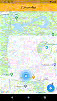

# Flutter - Custom Map Component

A Flutter based Map component, used to show map with current location & put custom pinpoint on map click.

## Table of contents
- [Flutter Support](#flutter-support)
- [Demo](#demo)
- [Features](#features)
- [Getting started](#getting-started)
- [Usage](#usage)
- [Methods](#methods)
- [Want to Contribute?](#want-to-contribute)
- [Collection of Components](#collection-of-Components)
- [Changelog](#changelog)
- [License](#license)
- [Keywords](#Keywords)

## Flutter Support

Version - Flutter 1.17 (stable)

We have tested our program in above version, however you can use it in other versions as well.

## Demo

------

## Features

* Load custom map with current location.
* Get latlng on map click and redirect in native map.

## Getting started

* Download this sample project and import custom_map_component.dart files in your Flutter App.
* Update Widgets UI & content based on your requirements.

## Usage

Setup process is described below to integrate in sample project.

### Methods

Add below pub dev libraries

    // add below pub dev library in pubspec.yaml file
        google_maps_flutter: ^2.5.0
        location: ^5.0.3
        url_launcher: ^6.2.2

    // sync libraries
       pub dev

Configure Map Component

    // Put Custom Map widget
       CustomMapComponent(
           onMapCreated: onMapCreated,
           onMapClick: onMapClick,
        )

    // pass required parameters
    // this will return current latlng after map created
       void onMapCreated(LatLng latLng) {
           //put required code
       }

    // this will return latlng, which corodinate we clicked on map
        void onMapClick(LatLng latLng) {
            //put required code
        }

Optional properties for extra feature and customization

    // this param is used for set predefine markers
       Set<Marker> markers

    // this param is used for set current location pinpoint icon
       String sourcePinpointPath

    // this param is used for set map clicked location pinpoint icon
       String destinationPinpointPath

    // this param is used to enable my location
       bool enableMyLocation

    // this param is used to set map types
       MapType mapType

------

## Directive options

### Google Map Integration

Get an API key at [https://cloud.google.com/maps-platform/](https://cloud.google.com/maps-platform)

Enable Google Map SDK for each platform

You can also find detailed steps to get start with Google Maps Platform [here](https://developers.google.com/maps/gmp-get-started).

### Android

Specify your API key in the application manifest android/app/src/main/AndroidManifest.xml:

        <manifest ...
          <application ...
            <meta-data android:name="com.google.android.geo.API_KEY"
                       android:value="YOUR KEY HERE"/>

### iOS

Specify your API key in the application delegate ios/Runner/AppDelegate.m:

        #include "AppDelegate.h"
        #include "GeneratedPluginRegistrant.h"
        #import "GoogleMaps/GoogleMaps.h"

        @implementation AppDelegate

        - (BOOL)application:(UIApplication *)application
            didFinishLaunchingWithOptions:(NSDictionary *)launchOptions {
          [GMSServices provideAPIKey:@"YOUR KEY HERE"];
          [GeneratedPluginRegistrant registerWithRegistry:self];
          return [super application:application didFinishLaunchingWithOptions:launchOptions];
        }
        @end

Or in your swift code, specify your API key in the application delegate ios/Runner/AppDelegate.swift:

       import UIKit
       import Flutter
       import GoogleMaps

       @UIApplicationMain
       @objc class AppDelegate: FlutterAppDelegate {
         override func application(
           _ application: UIApplication,
           didFinishLaunchingWithOptions launchOptions: [UIApplication.LaunchOptionsKey: Any]?
         ) -> Bool {
           GMSServices.provideAPIKey("YOUR KEY HERE")
           GeneratedPluginRegistrant.register(with: self)
           return super.application(application, didFinishLaunchingWithOptions: launchOptions)
         }
       }

Opt-in to the embedded views preview by adding a boolean property to the app's Info.plist file with the key io.flutter.embedded_views_preview and the value YES

You have to add this permission in Info.plist :

       NSLocationWhenInUseUsageDescription
       NSLocationAlwaysUsageDescription

------

## Want to Contribute?

- Created something awesome, made this code better, added some functionality, or whatever (this is the hardest part).
- [Fork it](http://help.github.com/forking/).
- Create new branch to contribute your changes.
- Commit all your changes to your branch.
- Submit a [pull request](http://help.github.com/pull-requests/).

------

## Collection of Components
 We have built many other components and free resources for software development in various programming languages. Kindly click here to view our [Free Resources for Software Development.](https://www.weblineindia.com/software-development-resources.html)

------

## Changelog
Detailed changes for each release are documented in [CHANGELOG](./CHANGELOG).

## License
[MIT](LICENSE)

[mit]: ./LICENSE

## Keywords
Flutter Custom Map Component, Custom Map Component, Map Component, Flutter Map, Flutter Map SDK, Map, Weblineindia
